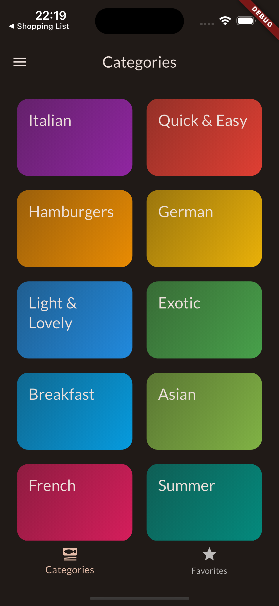
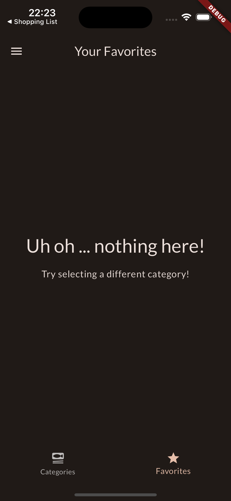
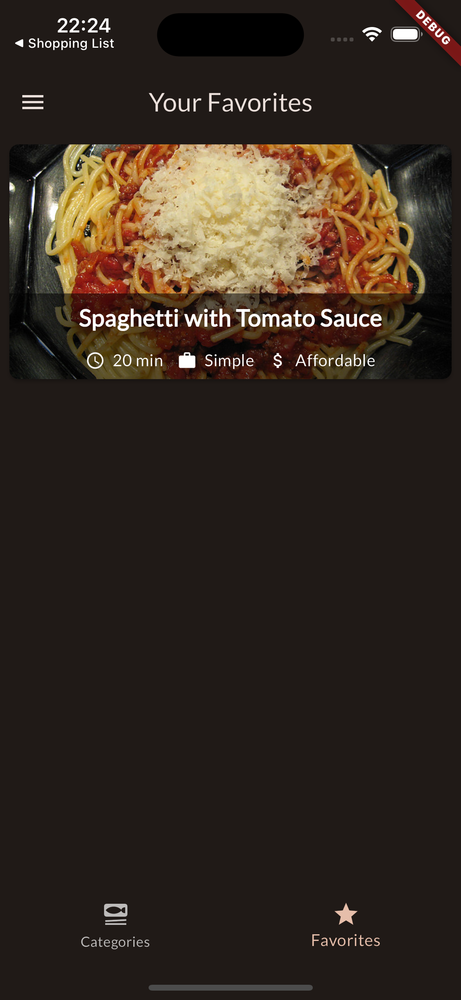
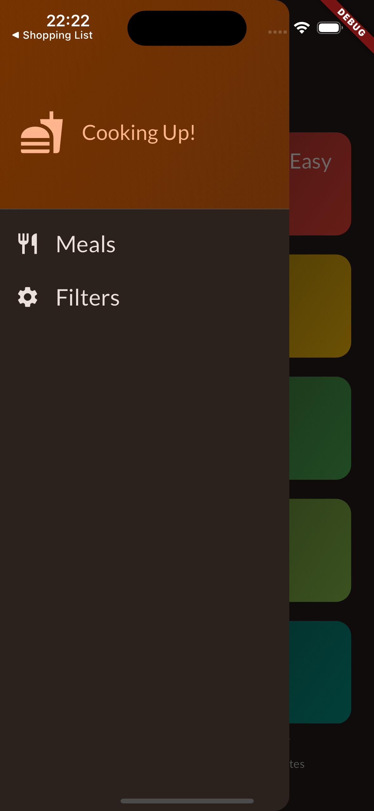
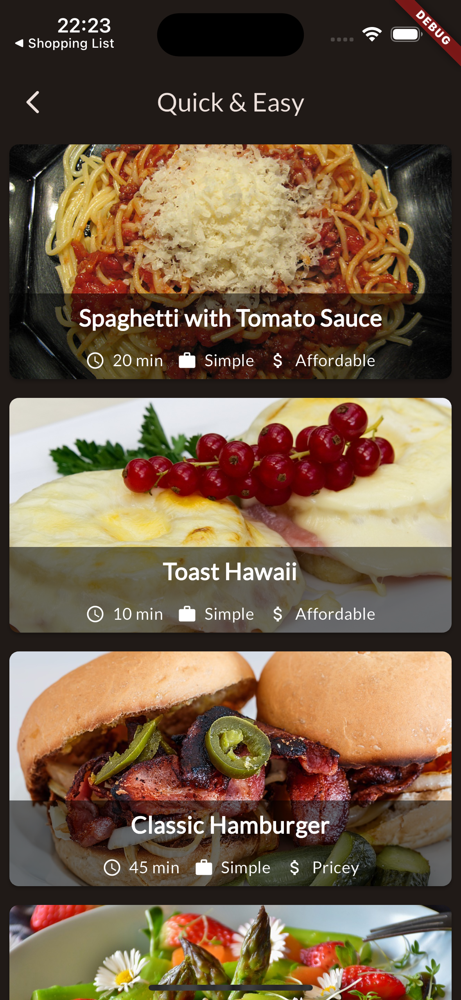
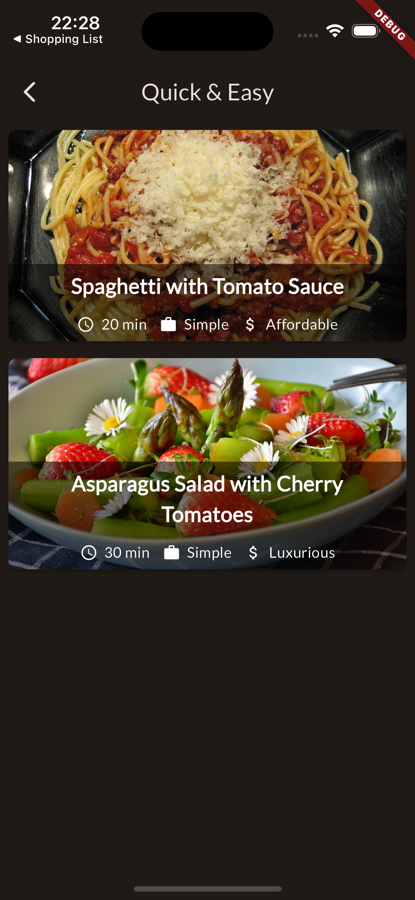
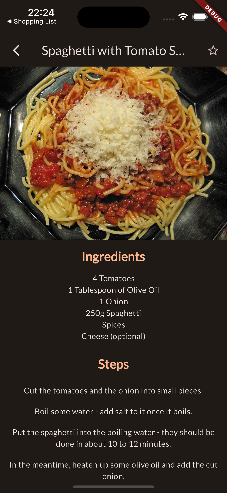
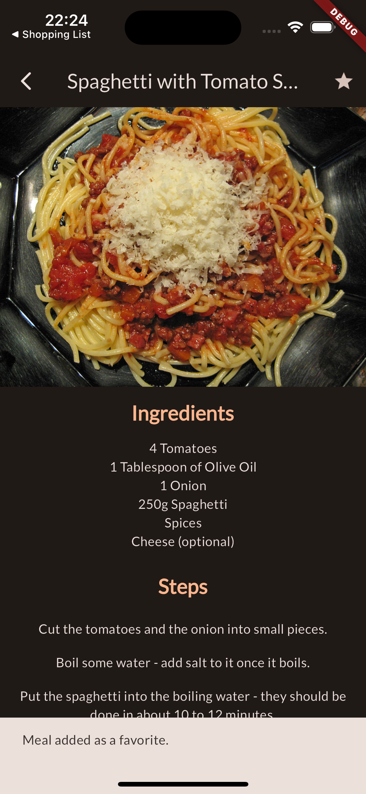
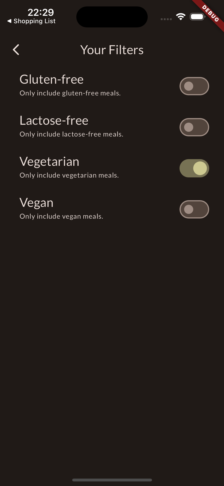

# meals
- 食事管理アプリ

## 仕様技術\

## 画面仕様
カテゴリ画面 カテゴリタブ | カテゴリ画面 お気に入りタブ(アイテムなし) | カテゴリ画面 お気に入りタブ(アイテムあり)
--- | --- | ---
 |  | 
カテゴリタップで食事画面に遷移 | お気に入り未追加の場合 | お気に入り追加済の場合

サイドドロワー | 食事画面(フィルターなし) | 食事画面(フィルターあり)
--- | --- | ---
 |  | 
Meals: カテゴリ画面へ遷移 Filter: フィルター画面へ遷移 | カテゴリごとの食事を表示 | フィルターの条件に合わせて表示

詳細画面(お気に入り未追加) | 詳細画面(お気に入り追加済) | フィルター画面
--- | --- | ---
 |  | 
右上の☆が白抜き | 右上の☆が色付き | フィルターで選択した条件に合わせて食事画面の表示条件が変更される
